# Authentication & Authorization Architecture Design

## 📊 Complete Flow Diagrams

> **💡 Tip:** Click vào tiêu đề diagram để mở Mermaid Live Editor và xem interactive version!

---

## 1. TOTAL AUTHENTICATION FLOW

[](https://mermaid.live/edit#pako:eNrqVspKzE0tLk5MT1WyUoKS8flFJUBqQmlqcXG6kmN-ak6pnZJSfmqxkpJ7fkFxalGJkmNyalFyTqldekrRgCwA2ykjRQ)

**🔗 Interactive Link:** https://mermaid.live/edit#pako:eNrqVspKzE0tLk5MT1WyUoKS8flFJUBqQmlqcXG6kmN-ak6pnZJSfmqxkpJ7fkFxalGJkmNyalFyTqldekrRgCwA2ykjRQ

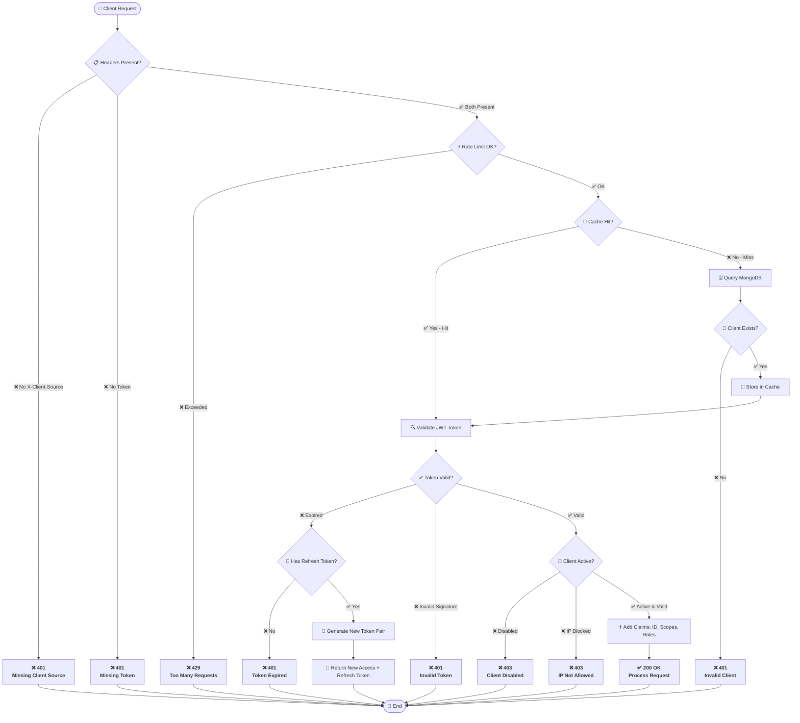

---

## 2. TOKEN REFRESH SEQUENCE

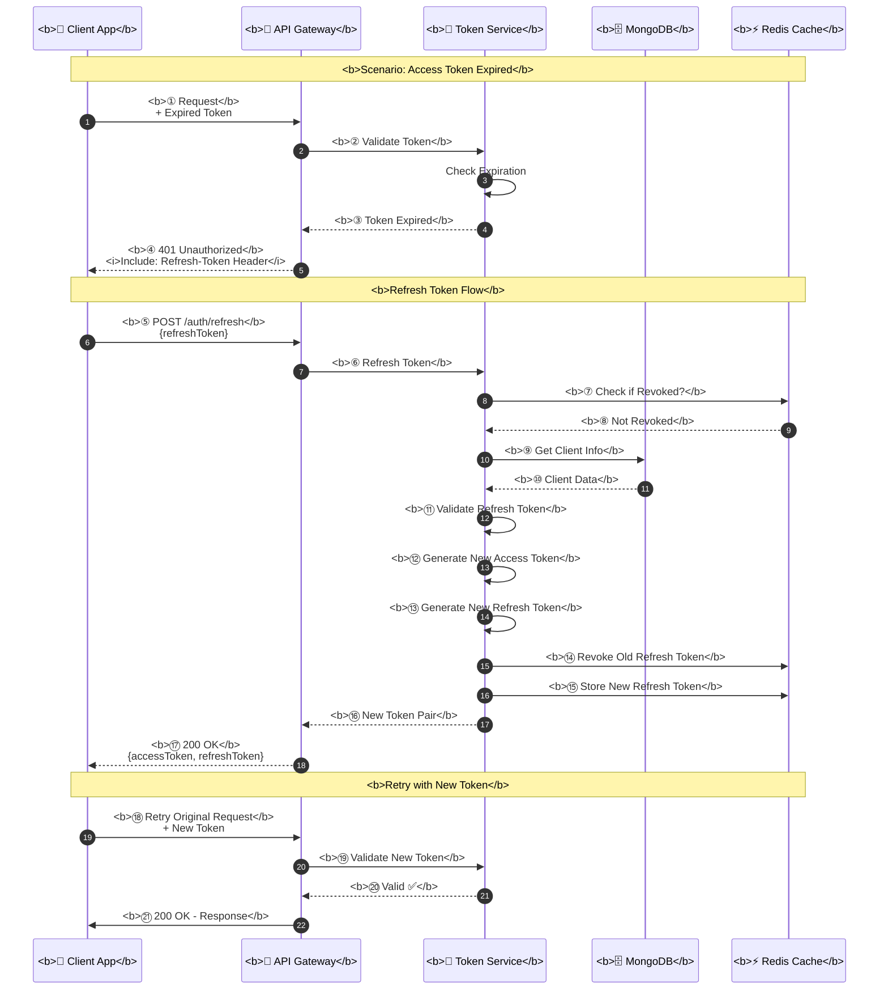

---

## 3. SYSTEM ARCHITECTURE OVERVIEW

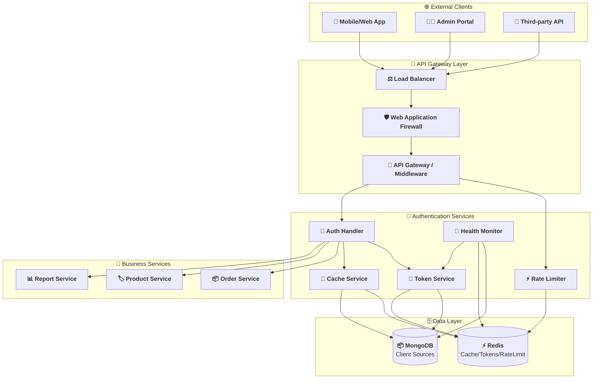

---

## 4. MIDDLEWARE PIPELINE

```mermaid
graph LR
    Request([📨 HTTP Request]) --> EH[<b>1️⃣ Exception Handler</b><br/>Global error handling]
    
    EH --> CORS[<b>2️⃣ CORS Policy</b><br/>Cross-origin check]
    
    CORS --> RL[<b>3️⃣ Rate Limiter</b><br/>Request throttling]
    
    RL --> AuthN[<b>4️⃣ Authentication</b><br/>Validate token & client]
    
    AuthN --> AuthZ[<b>5️⃣ Authorization</b><br/>Check permissions/scopes]
    
    AuthZ --> Controller[<b>6️⃣ Controller Action</b><br/>Business logic]
    
    Controller --> Response([📤 HTTP Response])
    
    style EH fill:#ffcccc
    style CORS fill:#ffffcc
    style RL fill:#ccffcc
    style AuthN fill:#ccccff
    style AuthZ fill:#ffccff
    style Controller fill:#ccffff
```

---

## 5. RATE LIMITING ALGORITHM

```mermaid
graph TB
    Start([📨 New Request]) --> GetClientId[📋 Extract Client ID]
    
    GetClientId --> GetLimit[⚙️ Get Rate Limit<br/>from config]
    
    GetLimit --> GetCurrentCount[📊 Get Current Count<br/>from Redis]
    
    GetCurrentCount --> CheckLimit{Current < Limit?}
    
    CheckLimit -->|❌ No - Exceeded| Return429[<b>❌ 429 Too Many Requests</b><br/>Add Retry-After header]
    
    CheckLimit -->|✅ Yes - OK| Increment[➕ Increment Counter<br/>in Redis]
    
    Increment --> SetExpiry[⏰ Set TTL = 60s<br/>if first request]
    
    SetExpiry --> Allow[<b>✅ 200 OK</b><br/>Pass to next middleware]
    
    Return429 --> End([🏁 End])
    Allow --> End
    
    Note right of Start: <b>Sliding Window Algorithm</b><br/>Window: 1 minute<br/>Precision: per-second
```

---

## 6. CACHING STRATEGY

```mermaid
graph TB
    Start([🔍 Need Client Data]) --> CheckCache{💾 Check Redis Cache}
    
    CheckCache -->|✅ Cache Hit| ReturnCached[<b>✅ Return Cached Data</b><br/>~5ms response]
    
    CheckCache -->|❌ Cache Miss| QueryDB[🗄️ Query MongoDB<br/>~50ms response]
    
    QueryDB --> Found{Client Found?}
    
    Found -->|❌ No| ReturnNull[<b>❌ Return null</b>]
    
    Found -->|✅ Yes| StoreCache[💾 Store in Redis<br/>TTL: 5 minutes]
    
    StoreCache --> ReturnData[<b>✅ Return Client Data</b>]
    
    ReturnCached --> End([🏁 End])
    ReturnNull --> End
    ReturnData --> End
    
    Note right of Start: <b>Cache-Aside Pattern</b><br/>• Absolute TTL: 5 min<br/>• Sliding TTL: 2 min<br/>• Manual invalidation on update
```

---

## 7. CIRCUIT BREAKER STATE MACHINE

```mermaid
stateDiagram-v2
    [*] --> Closed: <b>Start</b>
    
    Closed --> Closed: <b>✅ Success</b><br/>Reset failure count
    Closed --> Open: <b>❌ 5 Failures</b><br/>Open circuit
    
    Open --> Open: <b>⏰ Timeout Not Expired</b><br/>Fail fast
    Open --> HalfOpen: <b>⏰ Timeout Expired</b><br/>Try recovery
    
    HalfOpen --> Open: <b>❌ Failure</b><br/>Re-open circuit
    HalfOpen --> Closed: <b>✅ Success</b><br/>Circuit recovered
    
    note right of Closed
        <b>CLOSED State</b>
        • Normal operation
        • All requests allowed
        • Tracking failures
    end note
    
    note right of Open
        <b>OPEN State</b>
        • Circuit tripped
        • Fail fast (no calls)
        • Wait for timeout
    end note
    
    note right of HalfOpen
        <b>HALF-OPEN State</b>
        • Testing recovery
        • Allow 1 request
        • Decide: open or closed
    end note
```

---

## 8. DATA MODELS

### Client Source Document (MongoDB)

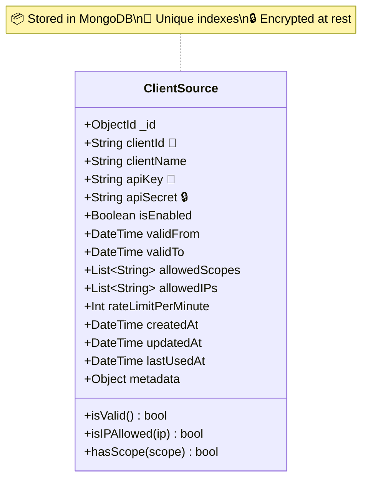

### JWT Token Structure

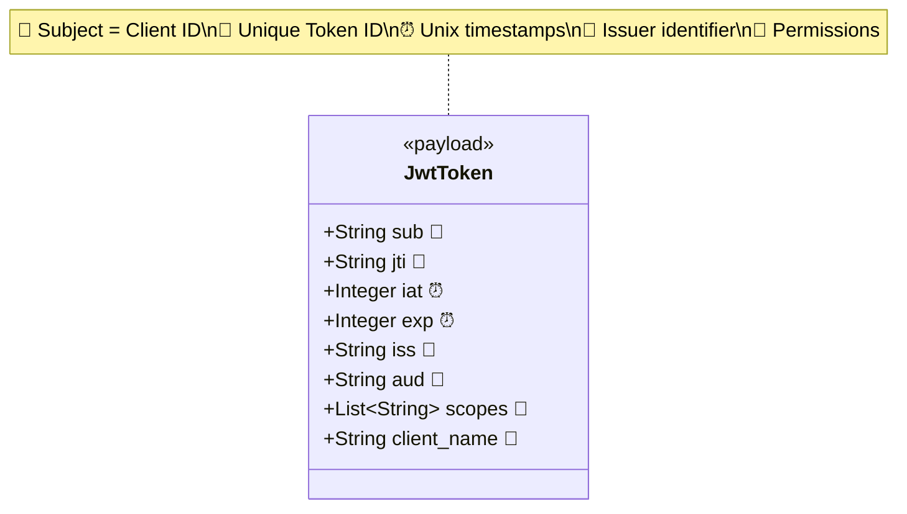

### Token Pair Response

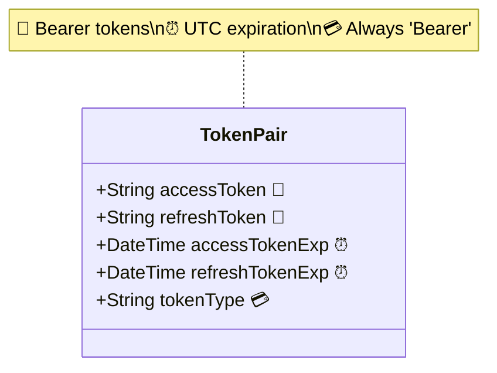

---

## 9. SECURITY LAYERS

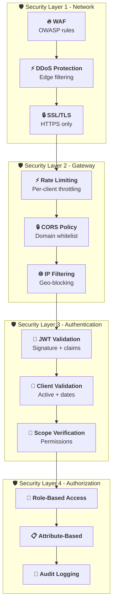

---

## 10. ERROR HANDLING MATRIX

```mermaid
graph TB
    Start([⚠️ Error Occurs]) --> TypeCheck{Error Type?}
    
    TypeCheck -->|Auth Failed| AuthErr[<b>🔐 Authentication Error</b>]
    TypeCheck -->|AuthZ Failed| AuthZErr[<b>🔒 Authorization Error</b>]
    TypeCheck -->|Rate Limit| RateErr[<b>⚡ Rate Limit Error</b>]
    TypeCheck -->|Validation| ValErr[<b>📋 Validation Error</b>]
    TypeCheck -->|Server Error| SrvErr[<b>💥 Server Error</b>]
    
    AuthErr --> Return401[<b>↩️ 401 Unauthorized</b><br/>WWW-Authenticate: Bearer]
    AuthZErr --> Return403[<b>↩️ 403 Forbidden</b><br/>Insufficient scope]
    RateErr --> Return429[<b>↩️ 429 Too Many Requests</b><br/>Retry-After: 60]
    ValErr --> Return400[<b>↩️ 400 Bad Request</b><br/>Validation details]
    SrvErr --> Return500[<b>↩️ 500 Internal Error</b><br/>Generic message]
    
    Return401 --> Log[📝 Log Error Details]
    Return403 --> Log
    Return429 --> Log
    Return400 --> Log
    Return500 --> Log
    
    Log --> Alert[🚨 Alert if Critical]
    
    Alert --> Response([📤 Error Response])
    
    Note right of Start: <b>Error Response Format</b><br/>• Never expose stack traces<br/>• Include error code<br/>• Add correlation ID<br/>• Log full details server-side
```

---

## 11. MONITORING & OBSERVABILITY

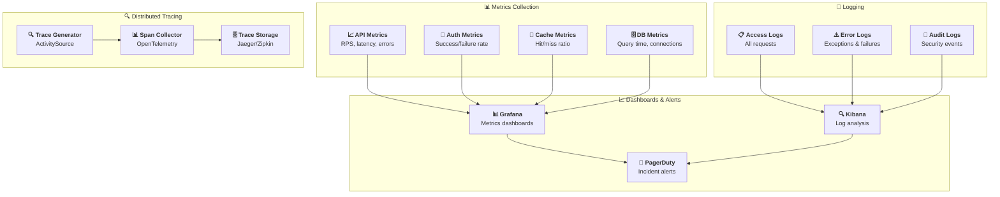

---

## 12. DEPLOYMENT TOPOLOGY

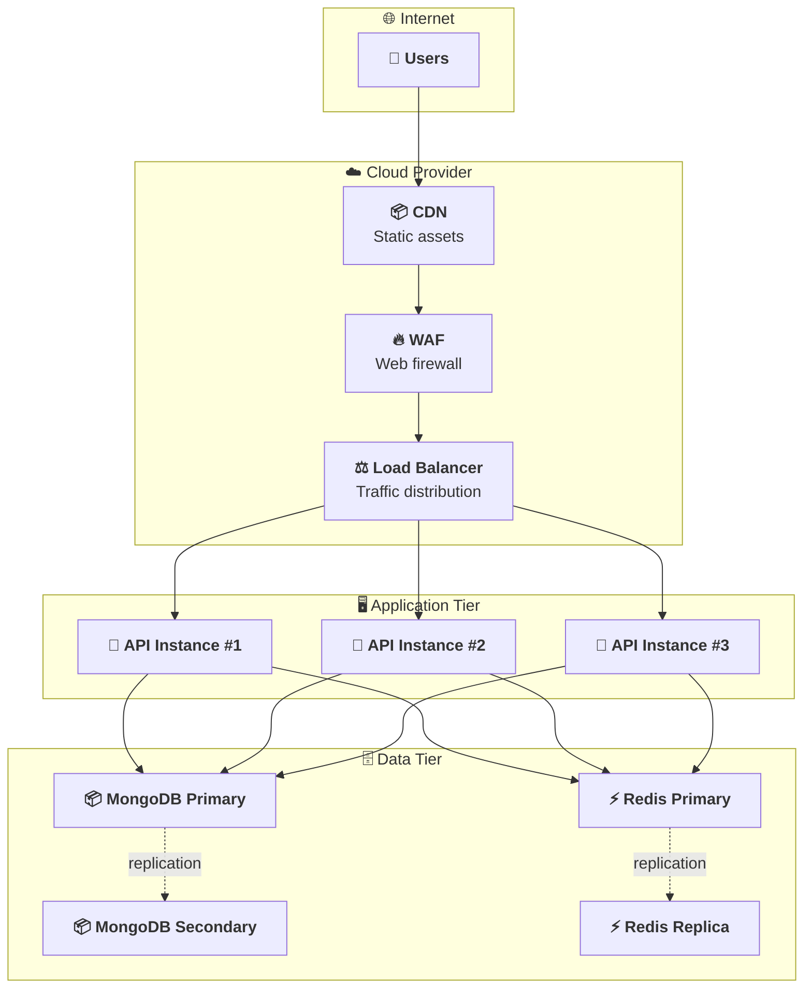

---

## QUICK REFERENCE CHEATSHEET

### 🔑 Key Ports & Endpoints

| Service | Port | Endpoint | Purpose |
|---------|------|----------|---------|
| API | 7209 | `/` | Main API |
| API Health | 7209 | `/health` | Overall health |
| API Live | 7209 | `/health/live` | Liveness probe |
| API Ready | 7209 | `/health/ready` | Readiness probe |
| MongoDB | 27017 | - | Database |
| Redis | 6379 | - | Cache |

### 🎯 HTTP Status Codes

| Code | Meaning | When |
|------|---------|------|
| 200 | OK | Success |
| 400 | Bad Request | Invalid input |
| 401 | Unauthorized | Missing/invalid token |
| 403 | Forbidden | Insufficient permissions |
| 429 | Too Many Requests | Rate limit exceeded |
| 500 | Internal Error | Server error |

### 🔐 Required Headers

| Header | Required | Example |
|--------|----------|---------|
| `X-Client-Source` | ✅ Yes | `my-app` |
| `Token` | ✅ Yes | `eyJhbGc...` |
| `Refresh-Token` | ⚠️ Optional | `abc123...` |
| `Content-Type` | ⚠️ For POST/PUT | `application/json` |

---

**📅 Last Updated:** 2024-01-01  
**👤 Author:** Architecture Team  
**📋 Version:** 2.0
